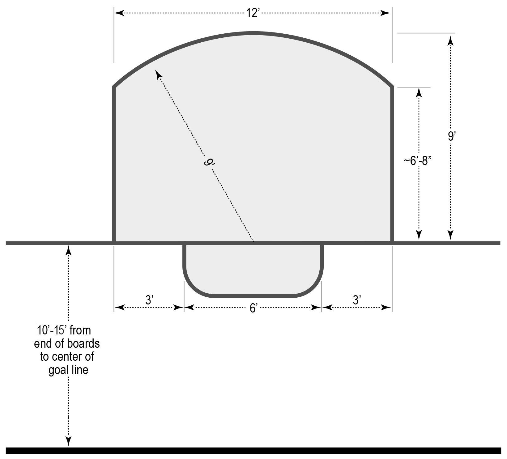

# Section 2: Equipment & Facilities

**§2.1 – Players**

* §2.1.1 – There are three players to a team in the traditional 3v3 format and five dressed players to a team in the 5v5 squad bench-style format.
  * §2.1.1.1 – While on the court, all players must wear a helmet approved for sports use.
  * §2.1.1.2 – Teams must wear matching colored uniforms, in contrast with the other team. A team can request a jersey change, but they are obligated to change before their opponents do.
  * §2.1.1.3 – In the squad format a team may utilize a roster of 6 players for the duration of a tournament. Prior to the start of each game the team must declare which 5 players are playing, and the 6th player is forbidden from entering the court during that game. 
  * §2.1.1.4 – A player may not interact with any Referee or Official, excluding the following signals:
    * Any player may indicate that a team is ready to restart play during stoppages and this indication is final. 
    * Any player may ask the Referee to announce the remaining game time or specify the name and severity of a penalty call during a stoppage, but cannot interact with the officials in any other way.
    * Any player may signal a timeout per §4.7.
    * If the Referee requests a conversation with the player.
  * §2.1.1.5 – Communication between all Players, the Referee and Officials must be in a commonly-shared language. This language can be determined at the beginning of the game by the Referee and both team captains. An unsportsmanlike conduct penalty per §7.2 may be assessed by the Referee.
* §2.1.2 – A team may appeal to the tournament organizers for substitution of a player in the case of injury or other outstanding circumstances during the course of a game and between games.
  * §2.1.2.1 – If a player is ejected from the tournament their team can only appeal for substitution after the game in which they were ejected.
  * §2.1.2.2 – In the squad format, you cannot appeal for a substitution during a game.
  * §2.1.2.3 – In the squad format, if you declared a roster of 6 players those players must act as your substitute until you have less than 5 uninjured players available to play.
  * §2.1.2.4 – The substituted player forfeits eligibility to play for any other team for the duration of the tournament.
  * §2.1.2.5 – The only eligible players for substitution are players who are not entered into the tournament, or players who have already been eliminated from the tournament prior to the current stage or elimination round of games.
  * §2.1.2.6 – A substituted player can only be replaced on the team by the original player or by subsequent injury.
    * §2.1.2.6.1 – Should an original player rejoin a team after a substitution, the team forfeits the opportunity for secondary substitution for that player. Additional injury, or inability of the player to continue, results in the team continuing without that player for the remainder of the tournament.
  * §2.1.2.7 – A team is given a reasonable amount of time - not exceeding 5 minutes - to find a substitution and have that player approved by tournament organizer and head Referee. This is consistent with §4.6 timeout procedure if used during a game.
* §2.1.3 – A team must designate a Captain and inform the Referee prior to each game. The Captain may interact respectfully with the Referee during stoppages regarding, substitutions, penalty disputes, equipment and other reasonable concerns, by entering the court and approaching the Referee. The Captain is not allowed to interact with the Referee during play or from outside of the court.

**§2.2 – Courts**

* §2.2.1 **–** Courts are no larger than 155’ x 80’ \(47.25 m x 25 m\) and no smaller than 120’ x 60’ \(37 m x 18 m\).
* §2.2.2 – Courts are constructed of a solid material with perimeter boards extending to a minimum height of 40”. If the tournament utilizes boards shorter than 40", the tournament organizer may implement additional rules regarding physical contact and out-of-play balls.
* §2.2.3 – Courts must have two doors located symmetric to the half–court line, for access to an area that players use to serve Minor/Major penalties, and to make player changes during squad/bench games.
  * §2.2.3.1 – A line is marked 10 feet \(10' or 3m\) from the center of each door in an arc and is referred to as the player transition area.
* §2.2.4 – A line marking half court extends across the entire width of the court with the center point of the court marked for placing the ball for jousts. Half court is also signified by markings on the vertical boards on either side of the court to indicate where dabbed players tap-in.
* §2.2.5 – There is a crease measuring 9 feet \(9' or 2.7432m\) in a semicircle from the center of the goal and goal line, cropped to 3 feet \(3' or 91.5cm\) from the outside of each goalpost. Refer to the diagram at the end of §2. The goal line extends all the way across the width of the court. 

**§2.3 – Goals**

* §2.3.1 – Goals have nets.
* §2.3.2 – Goals have a firm top crossbar.
* §2.3.3 – The goalmouth is 6’ \(183cm\) wide measured from the interior of the goalposts, by 3’ \(91.5 cm\) tall measured from interior of cross bar to the ground, by 2.5’ \(76.2 cm\) deep measured from goal line to interior of the rear base bar.
* §2.3.4 – The goal line defines the position of the goal. The goal line is 10’ \(3.05m\) to 15’ \(4.57m\) away and parallel to the rear perimeter boards of the court.
* §2.3.5 – Goals are placed with the front of both goal posts level with the front of the goal line and centered in regards to the width of the court.
* §2.3.6 – Three lines marked onto the court define the position of the goal:
  * §2.3.6.1 – The goal line connects the vertical goalposts and defines the threshold the ball must cross in order for a goal to be awarded.
  * §2.3.6.2 – Two additional lines extending from each goalpost and running perpendicular to the goal line toward the back boards for at least 6 inches but no more than 2.5 feet.

**§2.4 – Bicycles**

* §2.4.1 – The bicycle has at least one hand-controlled braking mechanism.
* §2.4.2 – The handlebars are plugged or capped, and can extend no more than 13 inches \(13" or 330mm\) from the center of the stem.
* §2.4.3 – There are no racks, fenders, bottle cages, saddlebags or other additions to the bicycle that may aid in blocking passage of the ball.
  * §2.4.3.1 – Wheel covers, which only cover the spokes of the wheel, and disc rotor guards, are an exception to §2.4.3 and are permitted.
* §2.4.4 – There are no sharp edges, points, loose screws, or otherwise unsafe components. 
  * Potentially dangerous components include but are not limited to: 
    * Exposed freewheels and cogs.
    * Exposed chain rings.
    * Unprotected disc rotors and protruding axles.
  * §2.4.4.1 – If the part of the bike deemed unsafe can be reliably covered and secured, and is approved by the Referee, it is an exception to §2.4.4 and is permitted.

**§2.5 – Mallets**

* §2.5.1 – Shaft
  * §2.5.1.1 – The shaft is made of metal or carbon fiber.
  * §2.5.1.2 – The gripped end of the shaft is plugged or sealed.
  * §2.5.1.3 – The shaft does not protrude through the bottom of the mallet head.
* §2.5.2 – Mallet head
  * §2.5.2.1 – The mallet head is made of plastic.
  * §2.5.2.2 – The mallet head is securely fastened to the shaft.
  * §2.5.2.3 – The mallet head is a maximum of 6.5” \(165mm\) in length.
  * §2.5.2.4 – The inner diameter of any hole on the mallet head may not exceed 2.3” \(58.5mm\). The maximum outside diameter of the mallet head may not exceed 2.559" \(65mm\).
* §2.5.3 – Dangerous mallets
  * §2.5.3.1 – The Referee disallows the use of mallets that they deem dangerous. Examples of dangerous mallets include but is not limited to: Mallets that splinter, shatter, or break easily, mallets with sharp protrusions, etc.

**§2.6 – Ball**

* §2.6.1 – Ball
  * §2.6.1.1 – The ball measures 2.64" \(67mm\) in diameter, weighs 70 grams or less, is hollow and made from a high density material suitable for the climate.

**§2.7 – Crease Diagram**

